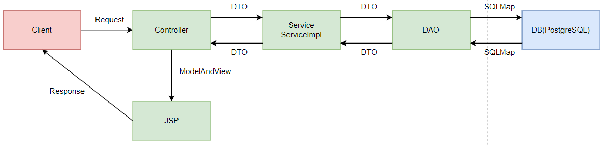
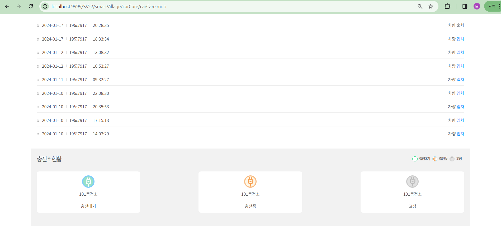

# 부산 스마트 빌리지 웹 서비스
### 부산 스마트 빌리지 주민들의 IoT 센서 기반 데이터 수집·분석·활용을 바탕으로 시각화 서비스를 제공
- WaterEnergy 서비스: 부산 스마트빌리지 세대주의 현재 년월일을 기준으로 최근 6개월까지의 물, 냉방, 난방, 급탕 에너지 소비량과 전년도의 에너지 소비량을 표시하고 전기 에너지 사용량의 경우 송전량까지 표시합니다.
- Environment 서비스: 부산 스마트빌리지 내 각 구역 별 가장 최근의 대기량을 표시하고 각 구역을 hover 했을 때 현재 시간 기준 6시간 까지의 대기량을 표시합니다.
- carCare 서비스: 부산 스마트빌리지 세대주의 차량 등록 현황과 차량 입출차 이벤트를 표시합니다.
- Board 서비스: 부산 스마트빌리지 주민들의 커뮤니티 공간으로, 게시물과 답글을 작성하고 조회수를 표시합니다.
<br></br>

### 목차

- [Build Setting](#Build-Setting)
- [DB 연결](#DB-연결)
- [WaterEnergy](#WaterEnergy)
- [Environment](#Environment)
- [carCare](#carCare)
- [Board](#Board)

# Build Setting

### 1. SV war파일 import

### 2. build path(SV 프로젝트 우클릭 후 properties - Java Build Path로 접근)에서 ClassPath에 postgresql-42.7.1.jar(jdbc 연결 파일)를 Add External JARs를 통해 추가

### 3. jdk 경로의 lib에 postgresql jdbc 연결 파일 추가

### 4. 톰캣 설치 경로의 lib에도 postgresql jdbc 연결 파일 추가

### 5. Tomcat admin port와 HTTP.1,1 port 겹치지 않게 설정

# DB 연결

### 1. pom.xml파일

- mysql 드라이버의 dependency를 주석처리 하고 postgresql 드라이버의 dependency 추가
    
    ```java
    <!-- <dependency>
      <groupId>mysql</groupId>
      <artifactId>mysql-connector-java</artifactId>
      <version>5.1.31</version>
    </dependency> -->
    <dependency>
        <groupId>org.postgresql</groupId>
        <artifactId>postgresql</artifactId>
        <version>42.7.1</version>
    </dependency>
    ```
    
- 드라이버 버전은 42.7.1로 무조건 동일한 버전을 사용해야 합니다.

### 2. context-datasource.xml파일

- <!— DataSource —> 아래 bean id="dataSource-mysql” 모든 부분 주석 처리 후 
“dataSource-postgresql” 추가

```java
<bean id="dataSource-postgresql" class="org.apache.commons.dbcp.BasicDataSource" destroy-method="close">
    <property name="driverClassName" value="org.postgresql.Driver"/>
    <property name="url" value="jdbc:postgresql://localhost:5432/kwater?characterEncoding=UTF-8&useSSL=false&serverTimezone=UTC&verifyServerCertificate=false"/>
    <property name="username" value="postgres"/>
    <property name="password" value="0917"/>
</bean>
```

- url의 value와 username, password는 사용하려는 데이터베이스의 정보 값으로 교체해야 합니다.

# WaterEnergy

- 코드 디렉토리: https://github.com/hyeonseong0917/smartVillage/tree/main/SV-2/src/main/java/egovframework/smartVillage/usr/waterEnergy
- DAO: https://github.com/hyeonseong0917/smartVillage/blob/main/SV-2/src/main/java/egovframework/smartVillage/usr/waterEnergy/dao/WaterEnergyDAO.java
- Service: https://github.com/hyeonseong0917/smartVillage/blob/main/SV-2/src/main/java/egovframework/smartVillage/usr/waterEnergy/service/WaterEnergyService.java
- VO: https://github.com/hyeonseong0917/smartVillage/tree/main/SV-2/src/main/java/egovframework/smartVillage/usr/waterEnergy/vo
- Controller: https://github.com/hyeonseong0917/smartVillage/blob/main/SV-2/src/main/java/egovframework/smartVillage/usr/waterEnergy/web/WaterEnergyController.java
1. 최근 6개월 간 전기 탭에 전기 송전량 추가 및 전년도 전기 송전량을 그래프로 표시
2. 냉방 탭 추가
3. 최근 6개월 간의 데이터를 가져오도록 WaterEnergy_SQL.xml 쿼리 작성

### 1. 전기 탭에 전기 송전량 및 전년 전기 송전량 추가

- ExportChartVo.java 
    - 송전량 변수 추가를 위해 전기 에너지에 대해 ExportChartVo객체 생성
        - recentExports변수와 prevExports 변수 추가
        
        ```java
        public class ExportChartVo {
            private String regMonth;
            private String regYear;
            private double recentUsages;
            private double prevUsages;
            
            private double recentExports;
            private double prevExports;
            public void setRegMonth(String regMonth) {
                this.regMonth = regMonth;
            }
            public void setRegYear(String regYear) {
                this.regYear = regYear;
            }
            public void setPrevUsages(double prevUsages) {
                this.prevUsages = prevUsages;
            }
            public void setRecentUsages(double recentUsages) {
                this.recentUsages = recentUsages;
            }
            public void setPrevExports(double prevExports) {
                this.prevExports = prevExports;
            }
            public void setRecentExports(double recentExports) {
                this.recentExports = recentExports;
            }
            
            public String getRegMonth() {
                return regMonth;
            }
            public String getRegYear() {
                return regYear;
            }
            public double getRecentExports() {
                return recentExports;
            }
            public double getRecentUsages() {
                return recentUsages;
            }
            public double getPrevUsages() {
                return prevUsages;
            }
            public double getPrevExports() {
                return prevExports;
            }
        }
        ```
        
- WaterEnergy_SQL.xml: https://github.com/hyeonseong0917/smartVillage/blob/main/SV-2/src/main/java/egovframework/sqlmap/smartVillage/usr/waterEnergy/WaterEnergy_SQL.xml
    - 쿼리문 1개를 사용합니다.
    
    ```sql
    
    // 현재 기준으로 6개월 전까지의 사용량, 송전량과 전년도 기준 6개월 전까지의 사용량, 송전량을 가져오는 쿼리의 id 선언
    <select id="WaterEnergyDAO.selectElectricUsageChartData" parameterClass="string" resultMap="exportChartInfo" >
    ```
    
- 현재 사용량, 송전량과 전년도 오늘 날짜의 사용량, 송전량을 가져오는 selectElectricUsageChartData 쿼리를 작성합니다. 쿼리의 결과값은 exportChartInfo라는 VO객체 형태이며 다음 값들을 반환합니다.
    - 현재 날짜의 년도
    - 현재 날짜의 월
    - 현재 날짜의 사용량
    - 전년도 현재 날짜의 사용량
    - 현재 날짜의 송전량
    - 전년도 현재 날짜의 송전량
    
    ```sql
    SELECT
            CONCAT(CAST(recent_usage.reg_year AS VARCHAR),'년') AS reg_year,
            CONCAT(LPAD(CAST(recent_usage.reg_month AS VARCHAR), 2, '0'),'월') AS reg_month,
            recent_usage.power_receive_month AS recent_usages,
            prev_usage.power_receive_month AS prev_usages,
            recent_export.power_transmission_month AS recent_exports,
            prev_export.power_transmission_month AS prev_exports
        FROM
            (
            SELECT
                EXTRACT(YEAR FROM TO_TIMESTAMP(reg_date, 'YYYY-MM-DD"T"HH24:MI')) AS reg_year,
                EXTRACT(MONTH FROM TO_TIMESTAMP(reg_date, 'YYYY-MM-DD"T"HH24:MI')) AS reg_month,
                MAX(power_receive_month) AS power_receive_month,
                dongho
            FROM
                household_energy_msrmt_system1
            WHERE
                dongho = #houseDongHo#
                AND TO_TIMESTAMP(reg_date, 'YYYY-MM-DD"T"HH24:MI') BETWEEN DATE_TRUNC('MONTH', CURRENT_DATE - INTERVAL '7 months' - INTERVAL '1 year') AND (DATE_TRUNC('MONTH', CURRENT_DATE - INTERVAL '1 year') + INTERVAL '1 month' - INTERVAL '1 day')
            GROUP BY
                EXTRACT(YEAR FROM TO_TIMESTAMP(reg_date, 'YYYY-MM-DD"T"HH24:MI')),
                EXTRACT(MONTH FROM TO_TIMESTAMP(reg_date, 'YYYY-MM-DD"T"HH24:MI')),
                dongho
            ORDER BY
                reg_year DESC, reg_month DESC  
            LIMIT 6  
            ) prev_usage,
            (
            SELECT
                EXTRACT(YEAR FROM TO_TIMESTAMP(reg_date, 'YYYY-MM-DD"T"HH24:MI')) AS reg_year,
                EXTRACT(MONTH FROM TO_TIMESTAMP(reg_date, 'YYYY-MM-DD"T"HH24:MI')) AS reg_month,
                MAX(power_receive_month) AS power_receive_month,
                dongho
            FROM
                household_energy_msrmt_system1
            WHERE
                dongho = #houseDongHo#
                AND TO_TIMESTAMP(reg_date, 'YYYY-MM-DD"T"HH24:MI') BETWEEN DATE_TRUNC('MONTH', CURRENT_DATE - INTERVAL '7 months') AND (DATE_TRUNC('MONTH', CURRENT_DATE) + INTERVAL '1 month' - INTERVAL '1 day')
            GROUP BY
                EXTRACT(YEAR FROM TO_TIMESTAMP(reg_date, 'YYYY-MM-DD"T"HH24:MI')),
                EXTRACT(MONTH FROM TO_TIMESTAMP(reg_date, 'YYYY-MM-DD"T"HH24:MI')),
                dongho
            ORDER BY
                reg_year DESC, reg_month DESC 
            LIMIT 6  
            ) recent_usage,
            (
            SELECT
                EXTRACT(YEAR FROM TO_TIMESTAMP(reg_date, 'YYYY-MM-DD"T"HH24:MI')) AS reg_year,
                EXTRACT(MONTH FROM TO_TIMESTAMP(reg_date, 'YYYY-MM-DD"T"HH24:MI')) AS reg_month,
                MAX(power_transmission_month) AS power_transmission_month,
                dongho
            FROM
                household_energy_msrmt_system1
            WHERE
                dongho = #houseDongHo#
                AND TO_TIMESTAMP(reg_date, 'YYYY-MM-DD"T"HH24:MI') BETWEEN DATE_TRUNC('MONTH', CURRENT_DATE - INTERVAL '7 months' - INTERVAL '1 year') AND (DATE_TRUNC('MONTH', CURRENT_DATE - INTERVAL '1 year') + INTERVAL '1 month' - INTERVAL '1 day')
            GROUP BY
                EXTRACT(YEAR FROM TO_TIMESTAMP(reg_date, 'YYYY-MM-DD"T"HH24:MI')),
                EXTRACT(MONTH FROM TO_TIMESTAMP(reg_date, 'YYYY-MM-DD"T"HH24:MI')),
                dongho
            ORDER BY
                reg_year DESC, reg_month DESC  
            LIMIT 6  
            ) prev_export,
            (
            SELECT
                EXTRACT(YEAR FROM TO_TIMESTAMP(reg_date, 'YYYY-MM-DD"T"HH24:MI')) AS reg_year,
                EXTRACT(MONTH FROM TO_TIMESTAMP(reg_date, 'YYYY-MM-DD"T"HH24:MI')) AS reg_month,
                MAX(power_transmission_month) AS power_transmission_month,
                dongho
            FROM
                household_energy_msrmt_system1
            WHERE
                dongho = #houseDongHo#
                AND TO_TIMESTAMP(reg_date, 'YYYY-MM-DD"T"HH24:MI') BETWEEN DATE_TRUNC('MONTH', CURRENT_DATE - INTERVAL '7 months') AND (DATE_TRUNC('MONTH', CURRENT_DATE) + INTERVAL '1 month' - INTERVAL '1 day')
            GROUP BY
                EXTRACT(YEAR FROM TO_TIMESTAMP(reg_date, 'YYYY-MM-DD"T"HH24:MI')),
                EXTRACT(MONTH FROM TO_TIMESTAMP(reg_date, 'YYYY-MM-DD"T"HH24:MI')),
                dongho
            ORDER BY
                reg_year DESC, reg_month DESC
            LIMIT 6
            ) recent_export
        WHERE
            recent_usage.reg_month = prev_usage.reg_month AND
            recent_export.reg_month = prev_export.reg_month AND
            recent_usage.reg_month = recent_export.reg_month
        ORDER BY
            reg_year ASC, reg_month ASC;
    ```
    
- WaterEnergyDAO.java
    - List<UsageChartVo> 자료형을 가지는 selectCoolingUsageChartData() 메소드 선언
    - 전달된 SQL쿼리의 id를 기반으로 해당 쿼리를 실행합니다.
    - houseDongHo매개변수를 쿼리에 전달합니다.
    - 실행한 쿼리의 결과를 List<UsageChartVo>라는 객체 형태로 매핑시킵니다.
        
        ```java
        @Repository("waterEnergyDAO")
        public class WaterEnergyDAO extends EgovComAbstractDAO {
            // code
            public List<UsageChartVo> selectCoolingUsageChartData(String houseDongHo) throws Exception {
                return (List<UsageChartVo>) list("WaterEnergyDAO.selectCoolingUsageChartData", houseDongHo);
            }
        }
        ```
        
- WaterEnergyService.java
    - WaterEnergyServiceImpl.java에서 구현할 interface 선언
        
        ```java
        public interface WaterEnergyService {
            public List<ExportChartVo> selectElectricUsageChartData(String houseDongHo) throws Exception;
        }
        ```
        
- WaterEnergyServiceImpl.java
    - 인터페이스에서 선언된 selectElectricUsageChartData()를 구현
    
    ```java
    @Service("waterEnergyService")
    public class WaterEnergyServiceImpl extends EgovAbstractServiceImpl implements WaterEnergyService {
        @Override
        public List<ExportChartVo> selectElectricUsageChartData(String houseDongHo) throws Exception {
            return waterEnergyDAO.selectElectricUsageChartData(houseDongHo);
        }
    }
    ```
    
- WaterEnergyController.java
    - selectChartData(): ModelAndView(MVC 디자인 패턴에서 데이터 상태와 뷰를 함께 처리)객체를 생성하여 반환함
    - ModelAndView의 addObject 메소드를 이용해 “chartInfo” key에 
    waterEnergyService.selectElectricUsageChartData(user.getAddress())를 추가
    
    ```java
    @RequestMapping("/smartVillage/waterEnergy/getChartData.mdo")
    public ModelAndView selectChartData(@RequestParam(value = "tabId", defaultValue="water") String tabId, SessionStatus status) throws Exception {
        // code
        switch(tabId) {
        // electric case 수정
                case "electric":
                modelAndView.addObject("chartInfo", waterEnergyService.selectElectricUsageChartData(user.getAddress()));
                break;
    ```
    
- electric.jsp
    - drawChart() function을 수정합니다.
        - jsonData는 각 월 당 다음과 같은 데이터들로 이루어져 있습니다.
            - 년
            - 월
            - 현재 사용량
            - 전 년도 사용량
            - 현재 송전량
            - 전 년도 송전량
            
            data라는 배열에 년+월, 현재 사용량, 전 년도 사용량, 현재 송전량, 전 년도 송전량
            데이터를 추가합니다.
            
            차트를 표시하는 데 사용하는 chartData 배열에 data를 추가합니다.
            
            ```java
            let chartData = [['월','전년 전기 송전량', '전기 송전량', '전년 전기 사용량','전기 사용량' ]];
            for(var i=0; i<jsonData.length; i++){
                let data = [jsonData[i].regYear + jsonData[i].regMonth, Number(jsonData[i].prevExports.toFixed(2)), Number(jsonData[i].recentExports.toFixed(2)), Number(jsonData[i].prevUsages.toFixed(2)), Number(jsonData[i].recentUsages.toFixed(2))];
                chartData.push(data);
            }
            ```
            
        - chartData라는 배열을 Google Visualization API에서 지원하는 데이터 테이블 형식으로 변환하고 데이터 테이블을 기반으로 데이터 뷰를 생성합니다.
            
            ```java
            var data = google.visualization.arrayToDataTable(chartData);
            var view = new google.visualization.DataView(data);
            ```
            
        - 그래프 위에 숫자를 표시하고 전년 전기 사용량과 현재 전기 사용량, 전년 전기 송전량과 현재 전기 송전량 열 표시를 위해 setColumns 메소드를 사용합니다.
            
            ```java
            view.setColumns([
                                0,
                                1,  // 전년 전기 사용량 열
                                {
                                    calc: "stringify",
                                    sourceColumn: 1,
                                    type: "string",
                                    role: "annotation"
                                },
                                2,  // 전기 사용량 열
                                {
                                    calc: "stringify",
                                    sourceColumn: 2,
                                    type: "string",
                                    role: "annotation"
                                },
                                3,  // 전년 전기 송전량 열
                                {
                                    calc: "stringify",
                                    sourceColumn: 3,
                                    type: "string",
                                    role: "annotation"
                                },
                                4,   // 전기 송전량 열
                                {
                                    calc: "stringify",
                                    sourceColumn: 4,
                                    type: "string",
                                    role: "annotation"
                                },
                                ]);
            ```
            
        - options의 annotation에 textStyle을 추가해 그래프 위에 숫자를 표시합니다.
            
            ```java
            var options = {
                                title: "월별 전기 사용량 추이",
                                height: 200,
                                legend: { position: "bottom" },
                                tooltip : {
                                      /* trigger: 'both', */
                                      isHtml: true,
                                      showColorCode: true,
                                      trigger: 'both',
                                    },
                                annotations: {
                                    textStyle: {
                                       fontSize: 8,   // 원하는 폰트 크기
                                       bold: true,     // 굵게 설정
                                    }
                                },
                                bar: {
                                    groupWidth: '80%'  // 그래프 간 간격을 조절하는 부분
                                }
                                
                            };
            ```
            
        - 데이터를 시각화하고 그래프를 생성합니다.
            
            ```java
            var formatter = new google.visualization.NumberFormat({ pattern: '0' });
            formatter.format(data, 1);
            formatter.format(data, 2);
            formatter.format(data, 3);
            formatter.format(data, 4);
                            
            for (var i = 0; i < jsonData.length; i++) {
                data.setFormattedValue(i, 1, data.getValue(i, 1));
                data.setFormattedValue(i, 2, data.getValue(i, 2));
                data.setFormattedValue(i, 3, data.getValue(i, 3));
                data.setFormattedValue(i, 4, data.getValue(i, 4));
            }
                            
                            
            var chart = new google.visualization.ColumnChart($(".graph_box")[0]);
            
            chart.draw(view, options);
            ```

### 2. 냉방 탭 추가

- SV/src/webapp/smartVillage/m_01 디렉토리의 _02.html, _03.html, _04.html, _05.html 수정
- <div class=*"topM_box"*> 부분에 냉방 하이퍼링크 추가
    
    ```java
    <p><a href="_03.html" class="m_03"><i ></i>냉방</a></p>
    ```
    
- _03.html이 냉방 탭에 관련된 html이라 존재하지 않을 수 있습니다. 만약 존재하지 않을 경우 첨부한 프로젝트의 _03.html파일을 복사 붙여넣기 해주세요.

- WaterEnergy_SQL.xml
    - 쿼리문 2개를 사용합니다.
    
    ```bash
    // 현재 사용량과 전년도 오늘 날짜의 사용량을 가져오는 쿼리의 id 선언
    <select id="WaterEnergyDAO.selectCoolingUsage" parameterClass="string" resultMap="usageInfo" >
    
    // 현재 기준으로 6개월 전까지의 사용량과 전년도 기준 6개월 전까지의 사용량을 가져오는 쿼리의 id 선언
    <select id="WaterEnergyDAO.selectCoolingUsageChartData" parameterClass="string" resultMap="usageChartInfo" >
    ```
    
- 현재 사용량과 전년도 오늘 날짜의 사용량을 가져오는 selectCoolingUsage 쿼리를 
작성합니다. 쿼리는 다음 값들을 반환합니다.
    - 현재 날짜의 월
    - 해당 현재 날짜의 사용량
    - 전년도 현재 날짜의 월
    - 전년도 현재 날짜의 사용량
    
    ```sql
    <select id="WaterEnergyDAO.selectCoolingUsage" parameterClass="string" resultMap="usageInfo" >
            SELECT
                date_tab.recent_reg_date AS recent_reg_date,
                (
                    SELECT MAX("cooling_usage_month")
                    FROM household_energy_msrmt_system1
                    WHERE "dongho" = #houseDongHo#
                    AND "reg_date" = date_tab.recent_reg_date
                    GROUP BY "reg_date"
                    ORDER BY MAX("cooling_usage_month") DESC
                    LIMIT 1
                ) AS recent_usage,
                date_tab.prev_reg_date AS prev_reg_date,
                (
                    SELECT MAX("cooling_usage_month")
                    FROM household_energy_msrmt_system1
                    WHERE "dongho" = #houseDongHo#
                    AND "reg_date" = date_tab.prev_reg_date
                    GROUP BY "reg_date"
                    ORDER BY MAX("cooling_usage_month") DESC
                    LIMIT 1
                ) AS prev_usage
            FROM
                household_energy_msrmt_system1,
                (
                    SELECT
                        "dongho",
                        (
                            SELECT MAX("reg_date")
                            FROM household_energy_msrmt_system1
                            WHERE TO_TIMESTAMP("reg_date", 'YYYY-MM-DD"T"HH24:MI') BETWEEN (NOW() - INTERVAL '6 months') AND NOW()
                                AND "dongho"=#houseDongHo#
                        ) AS "recent_reg_date",
                        (
                            SELECT MAX("reg_date")
                            FROM household_energy_msrmt_system1
                            WHERE TO_TIMESTAMP("reg_date", 'YYYY-MM-DD"T"HH24:MI')=DATE_TRUNC('MONTH', CURRENT_DATE - INTERVAL '1 year')
                                AND "dongho"=#houseDongHo#
                        ) AS "prev_reg_date"
                    FROM
                        household_energy_msrmt_system1
                    WHERE
                        "dongho" = #houseDongHo#
                    GROUP BY
                        "dongho"
                ) date_tab
            WHERE
                household_energy_msrmt_system1."dongho" = date_tab."dongho"
            ORDER BY "cooling_usage_month" DESC
            LIMIT 1;
    ```
    

- 현재 기준으로 6개월 전까지의 사용량과 전년도 기준 6개월 전까지의 사용량을 가져오는 selectCoolingUsageChartData 쿼리를 작성합니다. 쿼리는 다음 값들을 반환합니다.
    - 년
    - 월
    - 해당 년 월에 사용한 에너지량
    - 해당 년 월 기준 1년 전에 사용한 에너지량
    
    ```sql
    <select id="WaterEnergyDAO.selectCoolingUsageChartData" parameterClass="string" resultMap="usageChartInfo" >
    SELECT
                CONCAT(CAST(recent_usage.reg_year AS VARCHAR),'년') AS reg_year,
                CONCAT(LPAD(CAST(recent_usage.reg_month AS VARCHAR), 2, '0'),'월') AS reg_month,
                recent_usage.cooling_usage_month AS recent_usages,
                prev_usage.cooling_usage_month AS prev_usages
            FROM
                (
                    SELECT
                        EXTRACT(YEAR FROM TO_TIMESTAMP(reg_date, 'YYYY-MM-DD"T"HH24:MI')) AS reg_year,
                        EXTRACT(MONTH FROM TO_TIMESTAMP(reg_date, 'YYYY-MM-DD"T"HH24:MI')) AS reg_month,
                        MAX(cooling_usage_month) AS cooling_usage_month,
                        dongho
                    FROM
                        household_energy_msrmt_system1
                    WHERE
                        dongho = #houseDongHo#
                        AND TO_TIMESTAMP(reg_date, 'YYYY-MM-DD"T"HH24:MI') BETWEEN DATE_TRUNC('MONTH', CURRENT_DATE - INTERVAL '7 months') AND (DATE_TRUNC('MONTH', CURRENT_DATE) + INTERVAL '1 month' - INTERVAL '1 day')
                    GROUP BY
                        EXTRACT(YEAR FROM TO_TIMESTAMP(reg_date, 'YYYY-MM-DD"T"HH24:MI')),
                        EXTRACT(MONTH FROM TO_TIMESTAMP(reg_date, 'YYYY-MM-DD"T"HH24:MI')),
                        dongho
                    ORDER BY
                        reg_year DESC, reg_month DESC
                    LIMIT 6
                ) recent_usage,
                (
                    SELECT
                        EXTRACT(YEAR FROM TO_TIMESTAMP(reg_date, 'YYYY-MM-DD"T"HH24:MI')) AS reg_year,
                        EXTRACT(MONTH FROM TO_TIMESTAMP(reg_date, 'YYYY-MM-DD"T"HH24:MI')) AS reg_month,
                        MAX(cooling_usage_month) AS cooling_usage_month,
                        dongho
                    FROM
                        household_energy_msrmt_system1
                    WHERE
                        dongho = #houseDongHo#
                        AND TO_TIMESTAMP(reg_date, 'YYYY-MM-DD"T"HH24:MI') BETWEEN DATE_TRUNC('MONTH', CURRENT_DATE - INTERVAL '7 months' - INTERVAL '1 year') AND (DATE_TRUNC('MONTH', CURRENT_DATE - INTERVAL '1 year') + INTERVAL '1 month' - INTERVAL '1 day')
                    GROUP BY
                        EXTRACT(YEAR FROM TO_TIMESTAMP(reg_date, 'YYYY-MM-DD"T"HH24:MI')),
                        EXTRACT(MONTH FROM TO_TIMESTAMP(reg_date, 'YYYY-MM-DD"T"HH24:MI')),
                        dongho
                    ORDER BY
                        reg_year DESC, reg_month DESC
                    LIMIT 6 
                ) prev_usage
            WHERE
                recent_usage.reg_month = prev_usage.reg_month
            ORDER BY
                reg_year ASC, reg_month ASC;
    ```
    
- WaterEnergyDAO.java
    - selectCoolingUsage 메소드 추가
        - 전달된 SQL쿼리의 id를 기반으로 해당 쿼리를 실행합니다.
        - houseDongHo매개변수를 쿼리에 전달합니다.
        - 실행한 쿼리의 결과를 UsageVo라는 객체 형태로 매핑시킵니다.
        
        ```java
        @Repository("waterEnergyDAO")
        public class WaterEnergyDAO extends EgovComAbstractDAO {
            //code
            public UsageVo selectCoolingUsage(String houseDongHo) throws Exception {
                return (UsageVo) select("WaterEnergyDAO.selectCoolingUsage", houseDongHo);
            }
        }
        ```
        
        - select 함수는 WaterEnergyDAO 클래스에서 상속받은 EgovComAbstractDAO 클래스의 메소드로, 데이터베이스 액세스를 단순화를 위해 사용합니다.
    
    - SelectCoolingUsageChartData 메소드 추가
        - 전달된 SQL쿼리의 id를 기반으로 해당 쿼리를 실행합니다.
        - houseDongHo매개변수를 쿼리에 전달합니다.
        - 실행한 쿼리의 결과를 UsageChartVo라는 객체들의 List 형태로 매핑시킵니다.
        
        ```java
        @Repository("waterEnergyDAO")
        public class WaterEnergyDAO extends EgovComAbstractDAO {
            //code
            public List<UsageChartVo> selectCoolingUsageChartData(String houseDongHo) throws Exception {
                return (List<UsageChartVo>) list("WaterEnergyDAO.selectCoolingUsageChartData", houseDongHo);
            }
        }
        ```
        
        - list함수는 WaterEnergyDAO 클래스에서 상속받은 EgovComAbstractDAO 클래스의 메소드로, 데이터베이스로부터 여러 결과를 반환하기 위해 사용합니다.

- WaterEnergyService.java
    - WaterEnergyServiceImpl.java에서 구현할 interface 선언
        
        ```java
        public interface WaterEnergyService {
            //code
            public UsageVo selectCoolingUsage(String houseDongHo) throws Exception;
            public List<UsageChartVo> selectCoolingUsageChartData(String houseDongHo) throws Exception;
        }
        
        ```
        
- WaterEnergyServiceImpl.java
    - 인터페이스에서 선언된 selectCoolingUsage()와 selectCoolingUsageChartData()를 구현
        
        ```java
        @Service("waterEnergyService")
        public class WaterEnergyServiceImpl extends EgovAbstractServiceImpl implements WaterEnergyService {
            //code
            @Override
            public UsageVo selectCoolingUsage(String houseDongHo) throws Exception {
                return waterEnergyDAO.selectCoolingUsage(houseDongHo);
            }
        
            @Override
            public List<UsageChartVo> selectCoolingUsageChartData(String houseDongHo) throws Exception {
                return waterEnergyDAO.selectCoolingUsageChartData(houseDongHo);
            }
        }
        ```
        
- WaterEnergyController.java
    - selectUsageInfo(): model(MVC 디자인 패턴에서의 데이터 상태)에 쿼리 결과를 저장하여 뷰에 데이터를 저장함
        - cooling case 추가
        - model의 “usageInfo” key에 waterEnergyService.selectHeatingUsage(user.getAddress())를 추가
        
        ```java
        @RequestMapping("/smartVillage/waterEnergy/waterEnergyUsage.mdo")
        public String selectUsageInfo(@RequestParam(value = "tabId", defaultValue="water") String tabId, Model model) throws Exception {
            switch(tabId) {
                        // case "cooling" 추가
                        case "cooling":
                            model.addAttribute("usageInfo", waterEnergyService.selectCoolingUsage(user.getAddress()));
                            viewName= "egovframework/smartVillage/usr/waterEnergy/cooling";
                            break;
        }
        ```
        
    - selectChartData(): ModelAndView(MVC 디자인 패턴에서 데이터 상태와 뷰를 함께 처리하는 객체)를 생성하여 반환함
        - cooling case 추가
        - ModelAndView의 addObject() 메소드를 이용해 “chartInfo” key에 
        waterEnergyService.selectCoolingUsageChartData(user.getAddress())를 추가
        
        ```java
        @RequestMapping("/smartVillage/waterEnergy/getChartData.mdo")
        public ModelAndView selectChartData(@RequestParam(value = "tabId", defaultValue="water") String tabId, SessionStatus status) throws Exception {
            switch(tabId) {
                    // cooling case 추가
                    case "cooling":
                        modelAndView.addObject("chartInfo", waterEnergyService.selectCoolingUsageChartData(user.getAddress()));
                        break;
        }
        ```
        

- water.jsp
    - drawChart() function을 수정합니다.
        - jsonData는 각 월 당 다음과 같은 데이터들로 이루어져 있습니다.
            - 년
            - 월
            - 현재 사용량
            - 전 년도 사용량
            
            data라는 배열에 년+월, 현재 사용량, 전 년도 사용량 데이터를 추가합니다.
            
            차트를 표시하는 데 사용하는 chartData 배열에 data를 추가합니다.
            
            ```java
            let chartData = [['월', '전년 냉방 사용량', '냉방 사용량' ]];
                            for(var i=0; i<jsonData.length; i++){
                                /* let prevRecentDifference = jsonData[i].prevUsages - jsonData[i].recentUsages; */
                                let data = [jsonData[i].regYear+" "+jsonData[i].regMonth, Number(jsonData[i].prevUsages.toFixed(4)), Number(jsonData[i].recentUsages.toFixed(4))];
                                chartData.push(data);
                            }
            ```
            
        - chartData라는 배열을 Google Visualization API에서 지원하는 데이터 테이블 형식으로 변환하고 데이터 테이블을 기반으로 데이터 뷰를 생성합니다.
            
            ```java
            var data = google.visualization.arrayToDataTable(chartData);
            var view = new google.visualization.DataView(data);
            ```
            
        - 그래프 위에 숫자를 표시하고 전년 물 사용량과 현재 물 사용량 열 표시를 위해 setColumns 메소드를 사용합니다.
            
            ```java
            view.setColumns([
                                0,
                                1,  // 전년 냉방 사용량 열
                                {
                                    calc: "stringify",
                                    sourceColumn: 1,
                                    type: "string",
                                    role: "annotation"
                                },
                                2,  // 냉방 사용량 열
                                {
                                    calc: "stringify",
                                    sourceColumn: 2,
                                    type: "string",
                                    role: "annotation"
                                }
                                ]);
            ```
            
        - options의 annotation에 textStyle을 추가해 그래프 위에 숫자를 표시합니다.
            
            ```java
            var options = {
                                title: "월별 냉방 사용량 추이",
                                height: 200,
                                legend: { position: "bottom" },
                                tooltip : {
                                      /* trigger: 'both', */
                                      isHtml: true,
                                      showColorCode: true,
                                      trigger: 'both',
                                    },
                                annotations: {
                                    textStyle: {
                                       fontSize: 10,   // 원하는 폰트 크기
                                       bold: true,     // 굵게 설정
                                    }
                                }
                            };
            ```
            
        - 데이터를 시각화하고 그래프를 생성합니다.
            
            ```java
            var formatter = new google.visualization.NumberFormat({ pattern: '0' });
            formatter.format(data, 1);
            formatter.format(data, 2);
                            
            for (var i = 0; i < jsonData.length; i++) {
                data.setFormattedValue(i, 1, data.getValue(i, 1));
                data.setFormattedValue(i, 2, data.getValue(i, 2));
            }
                                            
            var chart = new google.visualization.ColumnChart($(".graph_box")[0]);
            chart.draw(view, options);
            ```
                        

### 3. WaterEnergy_SQL.xml의 모든 쿼리 수정

- <select id=*"WaterEnergyDAO.selectElectricUsageChartData"* parameterClass=*"string"* resultMap=*"exportChartInfo"* >는 위에서 작성한 전기 탭 쿼리 참조
- <select id=*"WaterEnergyDAO.selectHotWaterUsage"* parameterClass=*"string"* resultMap=*"usageInfo"* >와 같은 selectUsage는 id=”selectCoolingUsage”에서 에너지 타입 변수만 바꿔서 동일한 쿼리로 작성
- <select id=*"WaterEnergyDAO.selectWaterUsageChartData"* parameterClass=*"string"* resultMap=*"usageChartInfo"* >와 같은 selectWaterUsageChartData는 id=”selectCoolingUsageChartData” 에서 에너지 타입 변수만 바꿔 동일한 쿼리로 작성


# Environment

1. 각 구역 별 가장 최근의 대기량 표시 및 각 구역을 Hover했을 때 현재 시간 기준 6시간 전까지의 대기량 표시
### Environment 최근 데이터 부재 문제

- smartpole1 테이블에 최근 데이터가 없어서 테스트를 위해 Environment_SQL.xml파일의 WHERE 조건문에서 각 시간을 NOW()가 아닌 NOW() - INTERVAL '1 month' - INTERVAL '15 day'로 대체하여 작성하였습니다.

### 1. 각 구역 별 가장 최근의 대기량 표시 및 각 구역을 Hover했을 때 현재 시간 기준 6시간 전까지의 대기량 표시

- 각 구역 별 가장 최근의 대기량 표시 및 각 구역을 Hover했을 때 현재 시간 기준 6시간 전까지의 대기량 표시
    - Environment_SQL.xml(데이터베이스 테이블이 달라짐에 따라 모든 쿼리 재작성)
        
        ```java
        // 빌리지 내 대기환경정보 사용량 표시 및 각 구역 별 가장 최근의 대기량 표시
        <select id="EnvironmentDAO.selectEnvironmentInfo" parameterClass="string" resultMap="invironmentInfo" >
        
        // 현재 시간 기준 6시간 전까지 시간별로 각 구역 별 대기량들 표시
        <select id="EnvironmentDAO.selectEnvironmentUsageChartData" parameterClass="string" resultMap="invironmentChartInfo" >
        ```
        
        - 빌리지 내 대기환경정보 사용량 표시 및 각 구역 별 가장 최근의 대기량을 표시하는 쿼리를 작성합니다. 쿼리는 다음 값들을 반환합니다.
            - 측정한 사물의 id
            - 측정한 사물의 이름(측정한 구역을 특정 가능)
            - 측정한 대기환경정보 종류
            - 흑정한 대기환경정보 값
        
        ```sql
        WITH ranked_data AS (
                    SELECT 
                        id,
                        CASE
                            WHEN SUBSTRING(thing FROM LENGTH(thing) - 3) = '0001' THEN '주출입구'
                            WHEN SUBSTRING(thing FROM LENGTH(thing) - 3) = '0002' THEN '도보출입구'
                            WHEN SUBSTRING(thing FROM LENGTH(thing) - 3) = '0003' THEN '1단지출입구'
                            WHEN SUBSTRING(thing FROM LENGTH(thing) - 3) = '0004' THEN '스마트플라자'
                            WHEN SUBSTRING(thing FROM LENGTH(thing) - 3) = '0005' THEN '공용공간'
                            WHEN SUBSTRING(thing FROM LENGTH(thing) - 3) = '0006' THEN '코리도1'
                            WHEN SUBSTRING(thing FROM LENGTH(thing) - 3) = '0007' THEN '코리도2'
                            WHEN SUBSTRING(thing FROM LENGTH(thing) - 3) = '0008' THEN '코리도3'
                        END AS thing_model_attribute_name,
                        #attributeType# AS thing_model_attribute_type,
                        CASE
                            WHEN #attributeType# = 'humidity' THEN humidity
                            WHEN #attributeType# = 'temperature' THEN air_temperature
                            WHEN #attributeType# = 'fine_dust' THEN pm10
                            WHEN #attributeType# = 'ultra_particles' THEN pm25
                            WHEN #attributeType# = 'noise_pollution' THEN noise
                            WHEN #attributeType# = 'ilumination' THEN iluminance
                        END AS thing_model_attribute_value,
                        ROW_NUMBER() OVER (PARTITION BY 
                                            CASE
                                                WHEN SUBSTRING(thing FROM LENGTH(thing) - 3) = '0001' THEN '주출입구'
                                                WHEN SUBSTRING(thing FROM LENGTH(thing) - 3) = '0002' THEN '도보출입구'
                                                WHEN SUBSTRING(thing FROM LENGTH(thing) - 3) = '0003' THEN '1단지출입구'
                                                WHEN SUBSTRING(thing FROM LENGTH(thing) - 3) = '0004' THEN '스마트플라자'
                                                WHEN SUBSTRING(thing FROM LENGTH(thing) - 3) = '0005' THEN '공용공간'
                                                WHEN SUBSTRING(thing FROM LENGTH(thing) - 3) = '0006' THEN '코리도1'
                                                WHEN SUBSTRING(thing FROM LENGTH(thing) - 3) = '0007' THEN '코리도2'
                                                WHEN SUBSTRING(thing FROM LENGTH(thing) - 3) = '0008' THEN '코리도3'
                                            END
                                            ORDER BY measurement_time DESC) AS rn
                    FROM
                        smartpole1
                    WHERE 
                        TO_CHAR(TO_TIMESTAMP(measurement_time, 'YYYY-MM-DD"T"HH24:MI:SS.US"Z"'), 'MI') BETWEEN '00' AND '10'
                        AND TO_CHAR(TO_TIMESTAMP(measurement_time, 'YYYY-MM-DD"T"HH24:MI:SS.US"Z"'), 'YYYY-MM-DD HH24:00:00')
                            BETWEEN TO_CHAR(NOW() - INTERVAL '1 month' - INTERVAL '15 day' - INTERVAL '6 hours', 'YYYY-MM-DD HH24:00:00') 
                            AND TO_CHAR(NOW() - INTERVAL '1 month' - INTERVAL '15 day', 'YYYY-MM-DD HH24:00:00')
                )
                SELECT 
                    id AS thing_model_attribute_id,
                    thing_model_attribute_name,
                    thing_model_attribute_type,
                    thing_model_attribute_value
                FROM 
                    ranked_data
                WHERE 
                    rn = 1
                ORDER BY 
                    id DESC
                LIMIT 8;
        ```
        
        - 각 구역 별 현재 시간 기준 6시간 전까지의 대기량을 표시하는 쿼리를 작성합니다.
            
            쿼리는 다음 값들을 반환합니다.
            
            - 측정한 사물의 이름(측정 구역을 특정 가능)
            - 측정한 대기환경정보 종류
            - 측정한 대기환경정보 값
            - 측정한 시간
            
            ```sql
            <select id="EnvironmentDAO.selectEnvironmentUsageChartData" parameterClass="string" resultMap="invironmentChartInfo" >
                    SELECT DISTINCT
                        CASE
                            WHEN SUBSTRING(thing FROM LENGTH(thing) - 3) = '0001' THEN '주출입구'
                            WHEN SUBSTRING(thing FROM LENGTH(thing) - 3) = '0002' THEN '도보출입구'
                            WHEN SUBSTRING(thing FROM LENGTH(thing) - 3) = '0003' THEN '1단지출입구'
                            WHEN SUBSTRING(thing FROM LENGTH(thing) - 3) = '0004' THEN '스마트플라자'
                            WHEN SUBSTRING(thing FROM LENGTH(thing) - 3) = '0005' THEN '공용공간'
                            WHEN SUBSTRING(thing FROM LENGTH(thing) - 3) = '0006' THEN '코리도1'
                            WHEN SUBSTRING(thing FROM LENGTH(thing) - 3) = '0007' THEN '코리도2'
                            WHEN SUBSTRING(thing FROM LENGTH(thing) - 3) = '0008' THEN '코리도3'
                        END AS thing_model_attribute_name,
                        #attributeType# AS thing_model_attribute_type,
                        CASE
                                WHEN #attributeType# = 'humidity' THEN humidity
                                WHEN #attributeType# = 'temperature' THEN air_temperature
                                WHEN #attributeType# = 'fine_dust' THEN pm10
                                WHEN #attributeType# = 'ultra_particles' THEN pm25
                                WHEN #attributeType# = 'noise_pollution' THEN noise
                                WHEN #attributeType# = 'ilumination' THEN iluminance
                            END AS thing_model_attribute_value,
                        TO_CHAR(TO_TIMESTAMP(measurement_time, 'YYYY-MM-DD"T"HH24:MI:SS.US"Z"'), 'HH24:MI:SS') AS measurement_time
                    FROM smartpole1
                    WHERE 
                        TO_CHAR(TO_TIMESTAMP(measurement_time, 'YYYY-MM-DD"T"HH24:MI:SS.US"Z"'), 'MI') BETWEEN '00' AND '10'
                        AND TO_CHAR(TO_TIMESTAMP(measurement_time, 'YYYY-MM-DD"T"HH24:MI:SS.US"Z"'), 'YYYY-MM-DD HH24:00:00')
                        BETWEEN TO_CHAR(NOW() - INTERVAL '1 month' - INTERVAL '15 day' - INTERVAL '5 hours', 'YYYY-MM-DD HH24:00:00') 
                        AND TO_CHAR(NOW() - INTERVAL '1 month' - INTERVAL '15 day', 'YYYY-MM-DD HH24:00:00')
                    ORDER BY measurement_time;
                </select>
            ```
            
    - EnvironmentDAO.java
        - selectEnvironmentUsageChartData 메소드 추가
            - 전달된 SQL쿼리의 id를 기반으로 해당 쿼리를 실행합니다.
            - attributeType매개변수를 쿼리에 전달합니다.
            - 실행한 쿼리의 결과를 List<InvironmentChartVO>라는 객체 형태로 매핑시킵니다.
                
                ```java
                public List<InvironmentChartVO> selectEnvironmentUsageChartData(String attributeType) throws Exception{
                        return (List<InvironmentChartVO>) list("EnvironmentDAO.selectEnvironmentUsageChartData", attributeType);
                    }
                ```
                
            - list함수는 WaterEnergyDAO 클래스에서 상속받은 EgovComAbstractDAO 클래스의 메소드로, 데이터베이스로부터 여러 결과를 반환하기 위해 사용됨
    - EnvironmentService.java
        - EnvironmentServiceImpl.java에서 구현할 interface에 selectEnvironmentUsageChartData 메소드  추가
            
            ```java
            public List<InvironmentChartVO> selectEnvironmentUsageChartData(String attributeType) throws Exception;
            ```
            
    - EnvironmentServiceImpl.java
        - 인터페이스에서 선언된 selectEnvironmentUsageChartData를 추가로 구현
            
            ```java
            @Override
                public List<InvironmentChartVO> selectEnvironmentUsageChartData(String attributeType) throws Exception{
                    return environmentDAO.selectEnvironmentUsageChartData(attributeType);
                }
            ```
            
        - 전달된 SQL쿼리의 id를 기반으로 해당 쿼리를 실행합니다.
        - attributeType매개변수를 쿼리에 전달합니다.
        - 실행한 쿼리의 결과를 InvironmentChartVO라는 객체들의 List 형태로 매핑시킵니다.
    - EnvironmentController.java
        - selectChartData(): ModelAndView(MVC 디자인 패턴에서 데이터 상태와 뷰를 함께 처리하는 객체)를 생성하여 반환함
            - ModelAndView의 “environmentChartInfo” key에 
            environmentService.selectEnvironmentUsageChartData(tabId)를 추가
                
                ```sql
                @RequestMapping("/smartVillage/environment/getChartData.mdo")
                    public ModelAndView selectEnvironmentChartInfo(@RequestParam(value = "tabId", defaultValue="fine_dust") String tabId, SessionStatus status) throws Exception {  
                        ModelAndView modelAndView = new ModelAndView("jsonView");
                        LoginVO user = (LoginVO)EgovUserDetailsHelper.getAuthenticatedUser();
                        modelAndView.addObject("environmentChartInfo", environmentService.selectEnvironmentUsageChartData(tabId));
                        return modelAndView;
                    }
                ```
                
    - fineDust.jsp(Environment의 다른 환경 정보 jsp파일들도 동일)
        - <div class=”sub_container”>의 <div class=”villageMap”>에 그래프 차트를 나타내는 
        해당 코드 추가
            
            ```java
            <div id="chart_div" style="width: 400px; height: 200px; position: absolute; top: 0px; right: 0px;"></div>
            ```
            
        - $('.villageMap a p')가 hover 되었을 때, 해당 구역의 최근 6개월 간의 대기량 쿼리를 반환하는 함수를 비동기적으로 실행해 쿼리 결과를 가져오고 차트로 표시하는 
        구성 요소 추가
            
            ```sql
            <script type="text/javascript">
            $(document).ready(function() {
                var specialDiv = $('#chart_div');
                console.log(specialDiv);
                $('.villageMap a p').hover(
                    function() {
                        
                        var textContent = $(this).find('span.arrow_box').text();
                        let firstLine = textContent.split('\n')[1];
            
                         // 공백 제거
                         let curPos = firstLine.replace(/\s/g, '');
                
                         let info=[];
                        $.getJSON("${pageContext.request.contextPath}/smartVillage/environment/getChartData.mdo", {tabId:encodeURI('fine_dust')}, function(json){
                            $(this).find('span.arrow_box').css('display', 'none');
                            var jsonData = json.environmentChartInfo;
                            if(jsonData == undefined || jsonData == ""){
                                return;
                            } else {
                                
                            }
              
                            let arr=[];
                            for(var i=0;i<jsonData.length;++i){
                                if(jsonData[i].thingModelAttributeName==curPos){
                                    arr.push(jsonData[i]);
                                }
                            }
                            /* console.log(arr); */
                            let hashMap={};
                            
                            for(var i=0;i<arr.length;++i){
                                var curTime=arr[i].measurementTime;
                                var curClock=curTime.substring(0,2);
                                if(!(curClock in hashMap)){
                                    hashMap[curClock]=1;
                                    info.push(arr[i]);
                                }
                            }
                            var chartData=[
                                ['시','미세먼지']
                            ];
                            for(var i=0;i<info.length;++i){
                                let tmpPos=[];
                                tmpPos.push(info[i].measurementTime.substring(0,2)+"시")
                                tmpPos.push(parseInt(info[i].thingModelAttributeValue));
                                chartData.push(tmpPos);
                            }   
                            google.charts.load('current', {'packages':['corechart']});
                            google.charts.setOnLoadCallback(drawChart);
            
                            function drawChart() {
                                var data = google.visualization.arrayToDataTable(chartData);
                                var view = new google.visualization.DataView(data);
                                view.setColumns([
                                    0,
                                    1,  // 전년 물 사용량 열
                                    {
                                        calc: function(dataTable, rowIndex) {
                                            // 소수점 둘째 자리까지 반올림하여 실수 값을 반환합니다.
                                            return parseFloat(dataTable.getValue(rowIndex, 1)).toFixed(2);
                                        },
                                        sourceColumn: 1,
                                        type: "string",
                                        role: "annotation"
                                    },
            
                                    ]);
                                var options = {
                                    title: '실시간 미세먼지',
                                    curveType: 'function', // 꺾은선 그래프로 설정
                                    legend: { position: 'bottom' },
                                    fontSize: 7,
                                    pointSize: 5, // 데이터 포인트 크기 지정
                                    pointShape: { type: 'circle' },
                                    annotations: {
                                        textStyle: {
                                            fontSize: 7,   // 원하는 폰트 크기
                                            bold: true,     // 굵게 설정
                                        }
                                    },
                                    backgroundColor: '#74ada7',
                                    /* backgroundColor: '#89c756', */
                                };
            
                                var chart = new google.visualization.LineChart(document.getElementById('chart_div'));
                                /* chart.draw(data, options); */
                                chart.draw(view, options);
                                
                            }
            
                            $(this).find('span.arrow_box').css('display', 'block');
                            specialDiv.show();
                            
                        })
                        var mouseX = event.pageX; // 마우스의 현재 x좌표
                        var mouseY = event.pageY; // 마우스의 현재 y좌표
                        /* console.log("마우스의 현재 위치 - x: " + mouseX + ", y: " + mouseY); */
                        var chartDiv = document.getElementById('chart_div');
                        chartDiv.style.position = 'absolute';
                        /* chartDiv.style.left = mouseX + 30 + 'px';
                        chartDiv.style.top = mouseY - 300 + 'px'; */
                    },
                );
            });
            </script>
            ```


            
            

# carCare
세대 차량 등록현황과 차량 입출차 이벤트 표시
            
            
    - CarInOutVo.java
        - 동호 수, 차량 번호, 입출차 이벤트, 입출차 날짜, 입출차 시간 속성이 매핑된 객체 생성
        
        ```java
        public class CarInOutVo{
            private String houseDongHo;
            private String carNumber;
            private String carInOutType;
            private String carInOutDate;
            private String carInOutTime;
            
            public String getHouseDongHo() {
                return houseDongHo;
            }
            public void setHouseDongHo(String houseDongHo) {
                this.houseDongHo = houseDongHo;
            }
            public String getCarNumber() {
                return carNumber;
            }
            public void setCarNumber(String carNumber) {
                this.carNumber = carNumber;
            }
            public String getCarInOutType() {
                return carInOutType;
            }
            public void setCarInOutType(String carInOutType) {
                this.carInOutType = carInOutType;
            }
            public String getCarInOutDate() {
                return carInOutDate;
            }
            public void setCarInOutDate(String carInOutDate) {
                this.carInOutDate = carInOutDate;
            }
            public String getCarInOutTime() {
                return carInOutTime;
            }
            public void setCarInOutTime(String carInOutTime) {
                this.carInOutTime = carInOutTime;
            }
        }
        ```
        
    - CarCare_SQL.xml
        - 주차 관리 시스템의 차량 입출입 이력 데이터를 조회하는 쿼리를 작성합니다.
        - 동호 수에 따른 차량의 입출입 데이터 이력을 조회하는 쿼리를 작성합니다.
        
        ```java
        // 동호 수, 차량 번호, 입출차 이벤트, 입출차 날짜, 입출차 시간 속성이 매핑된 객체 생성
        <resultMap id="carInOutVo" class="egovframework.smartVillage.usr.carCare.vo.CarInOutVo">
        
        // 등록된 차량과 동호수 매핑
        <select id="CarCareDAO.selectCarRegistInfo" parameterClass="string" resultClass="CarRegist" >
        
        // 주차 관리 시스템의 차량 입출입 이력 데이터를 조회
        <select id="CarCareDAO.selectCarInOutHist" parameterClass="string" resultMap="carInOutVo" >
        
        // 동호 수에 따른 차량의 입출입 데이터 이력을 조회
        <select id="CarCareDAO.selectChargeHist" parameterClass="string" resultClass="ChargeHist" >
        ```
        
        - 등록된 차량과 동호수를 매핑하는 쿼리를 작성합니다. 해당 쿼리는 다음 값들을 반환합니다.
            - 동호 수
            - 차 번호
            - 등록 날짜
            
            ```java
            <select id="CarCareDAO.selectCarRegistInfo" parameterClass="string" resultClass="CarRegist" >
                    SELECT
                        dongho AS houseDongHo,
                        car_num AS carNumber,
                        reg_date AS regDate
                    FROM
                        car_regist
                    WHERE
                        dongho = #houseDongHo#
                    ORDER BY
                        reg_date;
            ```
            
        - 주차 관리 시스템의 차량 입출입 이력 데이터를 조회하는 쿼리를 작성합니다. 해당 쿼리는 다음 값들을 반환합니다.
            - 동호수
            - 차 번호
            - 차량 입출입 이벤트
            - 입출입 날짜
            - 입출입 시간
            
            ```sql
            SELECT DISTINCT
                        car_regist.dongho AS house_dong_ho,
                        car_regist.car_num AS car_number,
                        car_in_out_hist.in_out_type AS car_in_out_type,
                        DATE(car_in_out_hist.parking_time) AS car_in_out_date,
                        SUBSTRING(car_in_out_hist.parking_time FROM 12) AS car_in_out_time
                    FROM
                        car_regist car_regist,
                        parking_management_system1 car_in_out_hist
                    WHERE
                        car_in_out_hist.vin = car_regist.car_num
                        AND car_regist.dongho = '101'
                    ORDER BY
                        car_in_out_date DESC,
                        car_in_out_time DESC
                    LIMIT 10;
            ```
            
        - 동호 수에 따른 차량의 입출입 데이터 이력을 조회하는 쿼리를 작성합니다. 해당 쿼리는 다음 값들을 반환합니다.
            - 동호 수
            - 입출입 날짜
            - biot모델 이름(주유소 위치 특정)
            - biot모델 이름이 있는 주유소의 충전 상태
    - CarCare.jsp
        - <div class=*"gray_full_box"*> 충전소 상태 변화 구현
        
        ```html
        <c:forEach items="${chargeHist}" var="chargeHist" varStatus="status">
                        <c:if test="${chargeHist.chargeState eq 'ready'}">
                            <p class="set_ok"><i></i>${chargeHist.houseDongHo}충전소<br></br>충전대기</p>
                        </c:if>
                        <c:if test="${chargeHist.chargeState eq 'ready'}"> 
                            <p class="set_ing"><i></i>${chargeHist.houseDongHo}충전소<br></br>충전중</p>
                        </c:if>
                        <c:if test="${chargeHist.chargeState eq 'ready'}"> 
                            <p class="set_no"><i></i>${chargeHist.houseDongHo}충전소<br></br>고장</p>
                        </c:if>
                        <c:if test="${chargeHist.chargeState eq 'charging'}"> 
                            <p class="set_ing"><i></i>${chargeHist.houseDongHo}충전소<br></br>충전중</p>
                        </c:if>
                        <c:if test="${chargeHist.chargeState eq 'unconnected'}"> 
                            <p class="set_no"><i></i>${chargeHist.houseDongHo}충전소<br></br>고장</p>
                        </c:if>
                    </c:forEach>
        ```
        

# Board
주민들의 커뮤니티 공간으로, 게시물과 답글을 작성하고 조회수를 표시합니다. DB변경(MySQL->PostgreSQL)으로 인해 게시물 테이블의 자료형이 String 자료형에서 bigint 자료형으로 바뀜에 따라 객체의 자료형을 수정하고 getter(),setter()함수들의 자료형도 바꿉니다.
            
- Board 객체에서 사용되는 parnts변수 정의
    - Board.java
        - parnts 변수의 자료형을 long으로 변환
        
        ```java
        private String parnts = "0";
        ```
        
        - getParnts() 메소드의 자료형을 long으로 변환
        
        ```java
        public long getParnts() {
                return parnts;
            }
        ```
        
        - setParnts(String parnts) 메소드에서 파라미터의 자료형을 String에서 long으로 변환
        
        ```java
        public void setParnts(long parnts) {
                this.parnts = parnts;
            }
        ```
        
    - EgovBBSManageServiceImpl.java
        - insertBoardArticle() 메소드에서 답글이 아닌 경우 setParnts 메소드의 파라미터 자료형을 String에서 long으로 변환
            
            ```java
            if ("Y".equals(board.getReplyAt())) {
                    // 답글인 경우 1. Parnts를 세팅, 2.Parnts의 sortOrdr을 현재글의 sortOrdr로 가져오도록, 3.nttNo는 현재 게시판의 순서대로
                    bbsMngDAO.replyBoardArticle(board);
                } else {
                    // 답글이 아닌경우 Parnts = 0, replyLc는 = 0, sortOrdr = nttNo(Query에서 처리)
                        board.setParnts(0);
                    }
            ```
            
    - BoardController.java
        - insertReplyBoard()메소드의 board.setParnts() 메소드에서 매개변수의 자료형을 Long.toString(boardVO.getNttId())에서 boardVO.getNttId()으로 변환
            
            ```java
            if (isAuthenticated) {
                        board.setReplyAt("Y");
                        board.setFrstRegisterId(user.getUniqId());
                        board.setBbsId(board.getBbsId());
            //          board.setParnts(Long.toString(boardVO.getNttId()));
                        board.setParnts(boardVO.getNttId());
            }
            ```
            
- Board 객체에서 사용되는 replyLc변수 정의
    - EgovBBSManageServiceImpl.java
        - insertBoardArticle 메소드에서 답글이 아닌 경우에 대해 board.setReplyLc() 함수의 매개변수 자료형을 “0”에서 0으로 변환
            
            ```java
            if ("Y".equals(board.getReplyAt())) {
                    // 답글인 경우 1. Parnts를 세팅, 2.Parnts의 sortOrdr을 현재글의 sortOrdr로 가져오도록, 3.nttNo는 현재 게시판의 순서대로
                    //code
                } else {
                    // 답글이 아닌 경우
                    // code
                    board.setReplyLc(0);
                 // code
            
                  
                }
            ```
            
    - Board.java
        - replyLc 변수의 자료형을 String에서 int로 변환
            
            ```java
            private int replyLc = 0;
            ```
            
        - getReplyLC() 메소드의 자료형을 String에서 int로 변환
            
            ```java
            public int getReplyLc() {
                    return replyLc;
                }
            ```
            
        - setReplyLC() 메소드의 매개변수 자료형을 String에서 int로 변환
            
            ```java
            public void setReplyLc(int replyLc) {
                    this.replyLc = replyLc;
                }
            ```
            
    - BoardController.java
        - insertReplyBoard 메소드의 board.setReplyLc() 메소드에서 매개변수의 자료형을 board.setReplyLc(Integer.toString(Integer.parseInt(boardVO.getReplyLc()) + 1));에서 board.setReplyLc((boardVO.getReplyLc() + 1))로 변환
